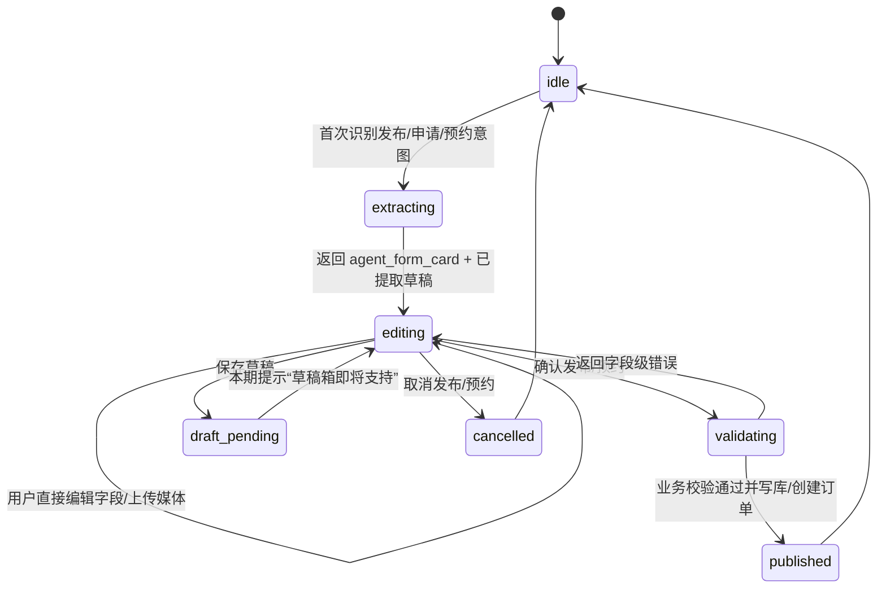

# Agent 内嵌发布与预约表单重构方案

更新时间：2026-08-17

## 1. 目标与范围

将 Agent 中的“发布企划、发布方案、发布作品、申请企划、预约方案”统一改为一次识别、卡片编辑、明确提交的流程。

- Agent 仅在首次识别到上述意图时，从**该条用户消息**抽取可识别字段，生成一份结构化草稿；预约方案还可以使用该消息明确引用的摄影师、方案或推荐卡上下文来确定目标资源。
- Agent 不再通过连续对话追问字段，也不再让用户以自然语言回复“确认发布”“确认预约”或“取消任务”来修改草稿。
- 客户端在对应 Agent 回复内渲染可编辑的表单卡片。已识别字段预填；空字段由用户直接补充。
- 卡片字段、字段类型、媒体限制、前端校验和后端校验必须与对应普通发布/申请页保持一致。
- 每张卡片只有三个操作：发布/申请任务为 `确认发布`、`保存草稿至草稿箱`、`取消发布`；预约任务为 `确认预约`、`保存草稿至草稿箱`、`取消预约`。
- `确认发布`：发布/申请任务按普通业务接口的同一规则校验，通过后写入数据库并返回资源结果。预约任务的对应主操作文案为 `确认预约`，校验通过后创建订单。
- `保存草稿至草稿箱`：本期仅定义稳定的协议、UI 状态和入口；不要求完成草稿箱持久化。
- `取消发布`/`取消预约`：只丢弃此 Agent 任务草稿，写入 `cancelled` 终态，聊天回到无进行中任务的初始状态；不得创建业务资源或订单。

不在本次范围：订单支付、摄影师接单、订单改期/取消等预约后流程，多轮咨询类任务，普通发布/预约页的大规模视觉重构，将二进制媒体直接经 AI 聊天接口上传。

## 2. 当前基线

普通表单和业务写入接口已经存在，应该作为唯一业务真相：

| 任务 | 现有普通页面 | 现有客户端写入 | 主要字段来源 |
| --- | --- | --- | --- |
| 发布企划 | `ProjectPublishPage.vue` | `createProject()` | `ProjectCreatePayload` / `ProjectCreate` |
| 发布方案 | `PackagePublishPage.vue` | `createPhotographerPackage()` | `PackageCreatePayload` |
| 发布作品 | `WorkPublishPage.vue` | 上传后更新 `updateWorkMetadata()` | `WorkPublishMetadata` / `PortfolioItemUpdate` |
| 申请企划 | `ProjectApplyPage.vue` | `applyToProject()`、`updateMyProjectApplication()` | `ProjectApplicationPayload` / `ProjectApplicationCreate` |
| 预约方案 | `BookingPage.vue` | `getAvailableSlots()`、`createOrder()` | `CreateOrderPayload` / `OrderCreateRequest` |

Agent 当前对企划和方案仍会保留 `missing_slots`、`collecting_slots`、`awaiting_reference_images` 等多轮补槽状态；预约仍使用 `awaiting_package`、`awaiting_date`、`awaiting_time`、`awaiting_confirmation` 多轮状态；作品与申请企划仍通过 `open_work_publisher`、`open_project_application` 跳转。移动端 `AIAssistantPage.vue` 还会在消息内渲染单字段输入框。这些都是本次要移除的旧路径。

## 3. 目标交互



### 3.1 首次识别规则

1. 仅当会话没有处于 `editing` 的 Agent 发布、申请或预约任务时，意图路由器才可创建新卡片。
2. 提取器只读取触发意图的当前用户消息、当前页面上下文和该消息所带附件分析结果；不得从之后的对话轮次补写字段。
3. 不确定、缺失或格式不合法的值保持为空，不能由模型虚构补齐。
4. 已有进行中卡片时，普通聊天回复不得隐式覆盖卡片数据；用户需在卡片内修改、取消后重开，或采用后续明确设计的“新建草稿”动作。
5. 申请企划必须先确定 `project_id`；目标不存在、已关闭、为本人企划、用户不具摄影师资格或已选中不可修改时，返回不可编辑的说明状态，不创建表单草稿。
6. 预约方案必须先确定有效的 `photographer_id + package_id`。如果用户只表达泛化预约需求，Agent 可以先返回推荐结果；只有用户消息明确选择某个方案或当前消息带有唯一方案上下文时才创建预约卡片。
7. 首次消息中的日期、时间和备注可以预填，但 Agent 不得把模型推断出的时间直接视为可预约档期。卡片出现后必须以普通预约接口加载并展示真实可用时段。

### 3.2 卡片状态

| 状态 | 可编辑 | 允许动作 | 服务端含义 |
| --- | --- | --- | --- |
| `editing` | 是 | 确认、保存草稿、取消 | 仅存 Agent 会话草稿，不写业务表 |
| `submitting` | 否 | 无，显示进度 | 带幂等键提交；防重复点击 |
| `invalid` | 是 | 确认、保存草稿、取消 | 返回字段级错误并聚焦第一处错误 |
| `draft_unavailable` | 是 | 确认、取消 | 本期草稿箱占位，不丢失本地卡片内容 |
| `published` | 否 | 查看资源/订单 | 已写库，显示资源名称或订单编号与跳转动作 |
| `cancelled` | 否 | 无 | 清除会话内任务草稿，恢复正常聊天 |
| `failed` | 是 | 重试确认、取消 | 仅用于非字段错误；保留卡片内容 |

`保存草稿至草稿箱` 不能伪装为成功。第一期点击后应进入 `draft_unavailable` 并明确说明“草稿箱暂未开放，当前内容仍保留在此卡片”，直到草稿持久化能力完成。

## 4. 统一协议

### 4.1 响应：表单卡片定义

新增并固定 `metadata.agent_form_card`，取代五类任务的发布/预约 `client_actions`、`suggested_actions` 以及用于收集字段的 `missing_slots` 和预约多轮等待状态。

```json
{
  "task_id": "uuid",
  "task_type": "create_project | publish_package | publish_work | project_application | create_booking",
  "status": "editing | submitting | invalid | draft_unavailable | published | cancelled | failed",
  "schema_version": 1,
  "target": { "project_id": 123 },
  "initial_fields": { "title": "..." },
  "field_errors": {},
  "media": { "existing": [], "limits": {} },
  "actions": ["publish", "save_draft", "cancel"],
  "revision": 1
}
```

约束：

- `initial_fields` 仅是 Agent 首轮抽取值。客户端后续编辑值属于本地表单状态，提交时整体发送。
- `revision` 用于乐观并发控制；提交、取消、存草稿请求必须带回最近版本，避免旧消息卡片覆盖新卡片。
- `task_id` 在同一会话唯一，不能由前端自行生成或替换。
- 服务端只接受白名单 `task_type`、字段和枚举值；前端不能相信模型返回的任意路由、接口地址或操作名称。

### 4.2 请求：表单动作提交

扩展 `AITaskSubmission` 为五类任务和三种动作；保留 `slots` 仅为兼容期读取，新增 `form_data` 作为正式负载。预约任务仍使用同一 action 名称，客户端将 `publish` 显示为“确认预约”。

```json
{
  "task_id": "uuid",
  "task_type": "create_project",
  "action": "publish | save_draft | cancel",
  "revision": 1,
  "form_data": { "...": "与普通表单 payload 一致" },
  "media_refs": ["已先上传完成的 URL"],
  "idempotency_key": "uuid"
}
```

- `publish`：按 `task_type` 将 `form_data` 映射至既有 schema/service，进行权限、目标资源状态、字段与媒体完整性复检，再在单事务中写库；`create_booking` 还需重新检查方案上架状态、摄影师身份、提前预约时间、最大可预约日期和档期冲突。
- `save_draft`：首期不写业务表，返回 `draft_unavailable`；草稿箱落地后改为写 `agent_form_drafts`，协议不变。
- `cancel`：校验任务归属和版本后清理会话草稿，返回 `cancelled`。发布/申请端显示“取消发布”，预约端显示“取消预约”；取消是幂等的。
- 上传沿用普通页的上传端点，拿到 URL 后才更新卡片的媒体引用；聊天接口不接收大文件二进制。

### 4.3 字段对齐

创建一个前端共享的 `agentFormDefinitions` 和后端共享的任务字段映射。它们引用普通表单的 payload 类型，而非重新维护第二套字段名。

| 卡片类型 | 提交字段 |
| --- | --- |
| `create_project` | `ProjectCreatePayload`，`publish` 由卡片动作固定为 `true`；包括地点坐标成对校验、时间、预算、交付、参考图、可见性、截止时间 |
| `publish_package` | `PackageCreatePayload`；包括价格、时长、服务内容、风格、城市/服务范围、样片、交付规格、授权、条款、支付方式 |
| `publish_work` | `WorkPublishMetadata` 加普通作品页已有的媒体资源引用；包括标题、描述、标签与媒体必填规则 |
| `project_application` | `ProjectApplicationPayload`；包括方案说明、报价、关联方案摘要、作品引用、条款事项 |
| `create_booking` | `CreateOrderPayload`；包括只读摄影师、只读/可选方案、从真实档期选择的 `appointment_time` 和最长 500 字备注。价格、时长、交付、授权、付款模式等必须由后端按 `package_id` 生成订单快照，不能接受 Agent 或前端自行指定 |

字段限制、日期/金额格式、枚举、最大长度和媒体上限均由普通表单已有类型及 Pydantic schema 提供。任何普通页新增字段，必须同步进入共享定义并加入契约测试。

### 4.4 预约方案专属约束

预约不是普通内容发布，不能只依赖一次静态表单校验，必须满足以下额外要求：

1. 卡片初始化后调用现有 `getAvailableSlots()`，按选中方案的真实时长、缓冲时间、提前预约要求和最大预约日期渲染日期与时段选择器。
2. 如果首次消息中的日期/时间仍可预约，自动选中对应时段；如果不可预约，保留用户意图提示，但不选中无效时段，并在字段附近说明原因。
3. 用户更换方案后立即清空原时段并重新请求档期，因为方案时长变化会改变可用时间。
4. `保存草稿至草稿箱` 只保存预约意向，不锁定档期，也不保证下次恢复时该时段仍可用；恢复草稿必须重新加载档期。
5. `确认预约` 请求到达后端时再次检查方案存在且上架、摄影师可预约、用户不是目标摄影师、时段满足提前量且未与订单/忙碌时间冲突。
6. 后端创建订单时只信任 `package_id`、`photographer_id`、`appointment_time` 和 `notes`。订单价格、时长、服务范围、交付规格、授权、取消/改期规则和付款模式均从方案生成不可变快照。
7. 并发抢占导致档期失效时返回字段级 `appointment_time` 错误和最新可用时段，卡片保持 `invalid`，不得自动替用户选择其他时间。
8. 成功后状态卡显示订单编号、摄影师、方案、预约时间以及“待摄影师确认”，并提供“查看订单”动作；不得显示为已支付或已最终锁定档期。

## 5. 卡片 UI 规范

卡片是 Agent 消息流中的一个独立工具面板，不是跳转后的页面，也不嵌套多层卡片。

- 宽度继承 Agent 消息列，`width: 100%`，在现有移动端内容最大宽度内布局；大屏不超过消息列宽度。
- 使用现有语义 token 与发布页的输入、TagEditor、PublishMediaPicker、地点选择和校验组件。不要在组件中写新的固定色值或第二套上传逻辑。
- 顶部仅显示任务类型、编辑中/提交中等文字状态和简短说明；已识别字段直接展示在可编辑控件内，不另做“已填槽位”摘要网格。
- 字段按普通页原有分组与顺序呈现；长表单允许主页面滚动，禁止卡片内部再嵌套滚动区域。
- 底部操作固定在卡片内部的操作区：发布/申请卡主操作为“确认发布”，预约卡主操作为“确认预约”；次操作为“保存草稿至草稿箱”，取消使用分离的危险样式。移动端最小 48px 点击区、操作间距至少 8px，并为底部系统安全区留白。
- 预约卡复用普通预约页的方案单选、日期横向选择和时段单选模式；日期带状区域可以自身横向滚动，但整张卡片和页面不得产生横向溢出。时段加载超过 300ms 时显示骨架或进度状态。
- 提交中禁用所有字段和操作，显示进度；字段错误紧邻字段并使用 `role=alert`，多个错误时顶部给出可定位的摘要，自动聚焦第一处错误。
- 取消前在有修改时二次确认；成功后卡片改为只读结果卡，发布/申请提供“查看已发布内容”，预约提供“查看订单”。
- 支持暗色、动态字体、键盘焦点、`prefers-reduced-motion`；状态不能只用颜色表达。

## 6. 构建实现顺序

### 阶段 0：冻结契约与回归基线

1. 盘点五个普通表单/预约流程的 payload、前端校验、上传或档期查询流程、后端 schema、权限和写入 service，输出字段映射表。
2. 定义 `agent_form_card`、`AITaskSubmission` 新字段、状态枚举、错误格式、`revision`、`idempotency_key` 和兼容窗口。
3. 为现有普通发布、申请和预约接口补齐回归测试，确认它们可以被 Agent 调用而不改变权限、事务和档期校验边界。

完成标准：接口契约以类型和测试固定；产品、前后端同意“草稿箱首期仅占位”的行为。

### 阶段 1：后端建立表单任务边界

1. 将首次意图识别拆为五个“仅提取当前消息”的草稿构建器；删除发布类任务的跨轮 `missing_slots` 合并，以及预约任务的 `awaiting_package/date/time` 对话补槽和自然语言确认分支。
2. 扩展 `AITaskSubmission`，新增 `publish_work`、`project_application`、`create_booking` 与 `cancel`，并引入任务 ID、版本和幂等键。
3. 新建 `agent_form_task_service`：读取任务、验证会话归属/状态/版本、校验 action、转换成对应业务 payload。
4. 复用 `project_service`、摄影师方案 service、作品 service、企划申请 service、`order_service` 与 `availability_service` 执行写入和档期复检；不要复制业务写库逻辑。
5. `publish` 在同一事务中完成目标状态复检、权限检查、schema 校验、业务写入、Agent 任务终态和审计日志；失败不销毁草稿。
6. 实现 `cancel` 幂等清理；实现 `save_draft -> draft_unavailable` 占位响应，并为后续 `agent_form_drafts` 表预留 repository 接口。

完成标准：五类任务的确认动作都可经 API 成功写库或创建订单；无效字段返回稳定字段错误；重复提交只产生一条资源/订单；取消不产生资源/订单；预约并发冲突可返回最新档期。

### 阶段 2：前端抽取共享表单能力

1. 在 `mobile-app/src/types` 建立 `agentForm.ts`，包含卡片协议、状态、五类 payload 适配器和错误类型。
2. 从四个普通发布/申请页和 `BookingPage.vue` 抽取可复用的字段分组、校验函数、字段组件、媒体处理与档期选择适配器；普通页与 Agent 卡片共同使用，避免字段漂移。
3. 新建 `AgentTaskFormCard.vue` 作为通用壳，并按任务类型拆分 `AgentProjectForm.vue`、`AgentPackageForm.vue`、`AgentWorkForm.vue`、`AgentProjectApplicationForm.vue`、`AgentBookingForm.vue`。
4. 以 `task_id + revision` 管理本地草稿，按输入防抖持久化到浏览器临时存储，仅用于刷新恢复；退出、取消和成功后清理。
5. 发布任务复用已有上传端点和 `PublishMediaPicker`，上传成功后才写入表单值；文件不能持久化时明确提示重新选择。预约任务复用 `getAvailableSlots()`，方案或日期变化时取消过期请求并清理无效选中项。

完成标准：五个普通页面/流程与卡片共用同一字段定义和校验；刷新后文本草稿可恢复；预约草稿恢复后重新请求档期；移动端 375px、平板和横屏无横向溢出。

### 阶段 3：接入 Agent 消息流并移除旧交互

1. `AIAssistantPage.vue` 识别 `metadata.agent_form_card` 并渲染新的可编辑卡片。
2. 删除发布类任务卡中的“待补充信息”单字段输入、`submitSlotEdit()`、自然语言 `confirmTask()` 与 `cancelTask()` 路径；同时删除预约的 `awaiting_package/date/time` 文本补充 UI 和自然语言确认预约路径。
3. 停止发布类 `open_work_publisher`、`open_project_application` 跳转；旧 `client_actions` 仅在兼容期渲染为只读提示，不能和新卡片同时出现。
4. 将发送动作统一为结构化 `task_submission`；成功时追加服务端返回的只读结果卡片，取消时将会话恢复为普通输入状态。
5. 对用户在卡片存在时发送普通消息的行为给出明确提示，不再将消息解释为补字段。

完成标准：用户无需离开 Agent 页面即可完成五类操作；发布与预约字段不会通过二次聊天被覆盖；旧路径无双重提交入口。

### 阶段 4：草稿箱持久化（预留功能落地时）

1. 新建 `agent_form_drafts` 表，保存用户、会话、任务类型、版本、payload、媒体引用、状态和过期时间；敏感字段按现有数据策略处理。
2. 将 `save_draft` 从占位改为实际持久化，返回草稿编号和恢复 action。
3. 在现有 `DraftsPage.vue` 增加 Agent 草稿分类、恢复、删除和过期提示；恢复时重新校验权限、目标企划状态或预约方案状态，并为预约重新获取档期。
4. 发布、创建订单或取消后关闭对应草稿，避免同一草稿重复发布或重复预约。

完成标准：草稿跨设备/刷新可恢复，发布幂等，取消后不可误恢复为可发布状态。

### 阶段 5：测试、观测

1. 后端单元和 API 测试：首次抽取不读后续消息、五类字段映射、权限、目标失效、字段错误、版本冲突、取消幂等、重复提交幂等、媒体引用归属，以及预约方案下架、提前量、最大日期、档期冲突和订单快照防篡改。
2. 前端组件测试：预填、编辑、字段错误、上传、档期加载、方案变化清空时段、不可用时间提示、提交中、取消确认、草稿占位、成功结果、刷新恢复、暗色与无障碍属性。
3. 端到端测试：五类任务均覆盖“首条消息 -> 卡片预填 -> 修改 -> 确认 -> 数据库资源/订单 -> 查看结果”；另覆盖取消、网络失败、重复点击、目标企划关闭、预约档期被并发占用和预约草稿恢复后档期失效。
4. 视觉回归：375px、768px、平板竖屏、手机横屏；检查安全区、键盘遮挡、动态文字、暗色和无横向滚动。
5. 埋点：意图命中、卡片出现、字段编辑、确认、校验失败、取消、草稿占位、成功、失败以及各任务的端到端耗时。

## 7. 验收清单

- 首条意图消息的可识别信息出现在卡片中，缺失值为空且可直接填写；预约卡可读取当前消息明确引用的摄影师/方案上下文。
- 发布与预约任务没有多轮字段追问、聊天补槽输入框或自然语言确认依赖。
- 卡片与对应普通页的字段、必填、格式、上传规则和后端校验一致。
- 四种确认发布和一种确认预约均只在后端复检成功后写入数据库，且重复点击不会产生重复资源或订单。
- 预约只允许选择真实可用时段，确认时再次复检；草稿不锁档，冲突后保留卡片并要求用户重新选时段。
- 取消后无业务资源/订单、无可继续编辑的进行中任务，聊天可正常开始新话题。
- 保存草稿当前显示真实的“预留”状态，不声称已保存；草稿功能落地后可无协议破坏地替换实现。
- 移动端 Agent 页面内卡片可完整操作，操作区符合现有设计系统、安全区、48px 点击区、暗色和无障碍要求。
