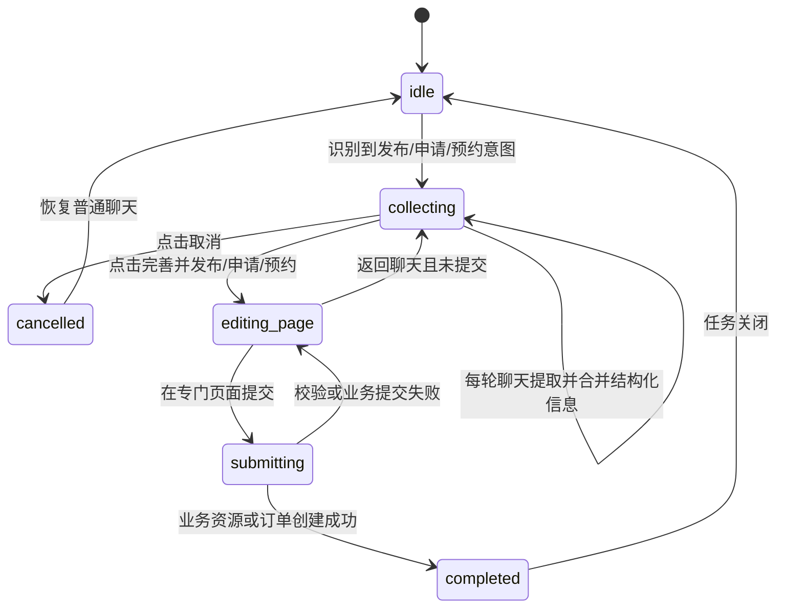

# Agent 发布 / 预约任务跨页接管改造指南

> 面向 Codex 的实施文档。本文以当前仓库代码为基线，定义新的 Agent 发布、申请与预约交互。
>
> 本方案替代 `docs/agent-embedded-publishing-form-refactor-plan.md` 中“在聊天消息内嵌完整可编辑表单”的方向。旧文档只作为历史背景，不再作为目标方案。

## 1. 改造结论

聊天页不再承载完整发布或预约表单。Agent 识别到任务后，应在后台建立一个独立的结构化任务草稿，并在后续每轮对话中持续从用户消息提取、校验和合并任务信息。

聊天页只展示一张紧凑、只读的任务摘要卡。卡片只允许两种操作：

1. `取消`：中断当前任务、清除活动任务状态并恢复普通聊天。
2. `完善并发布`：进入对应的专门页面，自动预填 Agent 已收集的全部结构化内容，由用户在完整页面中补充、校验并最终提交。

预约和申请任务的主操作文案按语义调整为 `完善并预约`、`完善并申请`，行为与 `完善并发布` 相同。

完整表单、媒体选择、地图、真实档期、字段错误和最终提交只存在于专门页面中。聊天页不得再出现输入框、下拉框、日期选择、媒体上传、时段选择、保存草稿或直接发布按钮。

## 2. 当前代码基线与问题

当前实现已经具备 `agent_form_card` 协议，但实现方向是完整内嵌表单：

- `mobile-app/src/components/AgentTaskFormCard.vue` 在聊天消息中渲染字段、媒体上传、档期和三个提交动作。
- `mobile-app/src/pages/AIAssistantPage.vue` 为每条包含 `metadata.agent_form_card` 的 assistant 消息渲染表单，因此历史消息可能保留过期任务 UI。
- `mobile-app/src/types/agentForm.ts` 维护了一套独立于普通发布页的字段定义，容易与真实表单漂移。
- `backend/app/services/agent_form_task_service.py` 通过“最新 assistant 消息的 metadata”查找任务，任务并不是独立、可跨页面读取的领域对象。
- `backend/app/services/ai_service.py` 只在部分入口建立首张卡片，活动任务期间没有稳定的逐轮结构化合并边界。
- `ProjectPublishPage.vue`、`PackagePublishPage.vue`、`WorkPublishPage.vue` 已有本机草稿恢复逻辑；`BookingPage.vue` 已有真实方案和档期加载逻辑，但它们都不能按 Agent `task_id` 获取并预填数据。

本次改造必须消除两套表单定义。普通发布、申请和预约页面继续作为表单交互与业务提交的唯一真相，Agent 只维护可映射到这些页面的结构化草稿。

## 3. 范围

覆盖当前五种 Agent 任务：

| Agent 任务 | 专门页面 | 路由 | 主操作文案 |
| --- | --- | --- | --- |
| `create_project` | `ProjectPublishPage.vue` | `publish-project` | 完善并发布 |
| `publish_package` | `PackagePublishPage.vue` | `publish-package` | 完善并发布 |
| `publish_work` | `WorkPublishPage.vue` | `publish-work` | 完善并发布 |
| `project_application` | `ProjectApplyPage.vue` | `project-apply` + `projectId` | 完善并申请 |
| `create_booking` | `BookingPage.vue` | `booking` + `photographerId` | 完善并预约 |

不在本次范围：支付、接单、订单改期/取消、自动替用户发布、在聊天卡片内编辑字段、同时维护多个活动发布任务、对普通发布页进行无关视觉重构。

## 4. 目标用户流程



关键行为：

1. Agent 第一次识别到任务时立即创建草稿，不等待必填字段齐全。
2. 用户仍可正常聊天。每条用户消息都先判断是否包含当前任务的新增、修正或清空信息，再正常生成聊天回复。
3. 摘要卡始终只有一个活动实例，位于最新 assistant 回复之后，不属于任何历史消息，不固定遮挡输入区。
4. 用户点击跳转后，专门页面通过 `agentTaskId` 从服务端读取最新草稿；URL 不携带 JSON 表单数据。
5. 专门页面的字段默认值、Agent 草稿、本机普通草稿和编辑模式数据必须按明确优先级合并，不能互相静默覆盖。
6. 用户从专门页面返回聊天但未提交时，任务仍处于活动状态，卡片主操作改为“继续完善并发布/申请/预约”。
7. 只有真实业务接口成功创建资源、申请或订单后，任务才进入 `completed`。

## 5. 活动任务必须成为独立状态

不要继续以“最新 assistant 消息的 metadata”作为任务事实来源。新增持久化模型 `AgentTaskDraft`，建议落在 `backend/app/models/ai_conversation.py` 或独立的 `backend/app/models/agent_task.py`，并新增 Alembic migration。

建议字段：

```text
id                  UUID / string primary key
conversation_id     FK ai_conversations.id
user_id             FK users.id
task_type           create_project | publish_package | publish_work |
                    project_application | create_booking
status              collecting | editing_page | submitting |
                    completed | cancelled | expired
schema_version      integer, initial value 2
revision            integer, every accepted patch increments
target              JSON, trusted project/package/photographer identifiers
fields              JSON, normalized complete draft
field_sources       JSON, per-field source message and confidence
media_assets        JSON, owned media asset references, not arbitrary URLs
result              JSON, created resource/order identifiers
opened_at            nullable datetime
created_at           datetime
updated_at           datetime
completed_at         nullable datetime
```

约束：

- 同一会话最多一个 `collecting` 或 `editing_page` 活动任务；数据库层和 service 层都要校验。
- 所有读取、取消、更新和完成操作都要校验 `user_id + conversation_id + task_id` 归属。
- `revision` 用于乐观并发，旧版本更新返回 `409` 和最新任务快照。
- assistant 消息 metadata 可以保存当轮任务快照用于审计和回放，但不能作为可变任务的查询源。
- `cancelled`、`completed`、`expired` 是终态；终态任务不能再次更新或提交。

## 6. 新的前后端协议

### 6.1 任务响应

用 `active_task` 取代可编辑的 `agent_form_card`。`AIChatResponse` 增加可空字段，同时活动任务查询接口返回同一结构。

```json
{
  "task_id": "uuid",
  "conversation_id": 12,
  "task_type": "create_project",
  "status": "collecting",
  "schema_version": 2,
  "revision": 4,
  "target": {},
  "fields": {
    "city": "香港",
    "style_tags": ["日系", "自然光"],
    "budget_min": 2000,
    "budget_max": 3000
  },
  "summary": {
    "title": "发布企划",
    "lines": [
      { "label": "地点", "value": "香港" },
      { "label": "风格", "value": "日系、自然光" },
      { "label": "预算", "value": "HK$2,000–3,000" }
    ],
    "collected_count": 4,
    "missing_required_count": 2,
    "media_count": 0
  },
  "result": null,
  "updated_at": "2026-08-17T10:00:00+08:00"
}
```

协议要求：

- `fields` 是专门页面预填的完整数据；`summary.lines` 是后端按任务类型确定性格式化的紧凑展示，不由 LLM 直接生成 HTML 或自由文案。
- 摘要最多显示 4 条高价值信息。长描述最多两行，并显示“已整理 N 项，另有 M 项可在发布页完善”。完整字段仍会在专门页面展示。
- `missing_required_count` 只用于提示，不用于禁用跳转。即使信息不完整，用户也可以进入专门页面完善。
- 前端根据 `task_type` 的白名单映射路由，不能执行服务端或模型返回的任意 URL、组件名或 action。

### 6.2 API

新增以下接口；命名可按现有 FastAPI 风格调整，但语义必须保持一致：

```text
GET    /ai/conversations/{conversation_id}/active-task
GET    /ai/conversations/{conversation_id}/tasks/{task_id}
PATCH  /ai/conversations/{conversation_id}/tasks/{task_id}
POST   /ai/conversations/{conversation_id}/tasks/{task_id}/open
POST   /ai/conversations/{conversation_id}/tasks/{task_id}/cancel
POST   /ai/conversations/{conversation_id}/tasks/{task_id}/complete
```

- `GET active-task`：刷新聊天页时恢复唯一活动任务，没有则返回 `204` 或 `null`。
- `GET task`：专门页面按任务 ID 拉取最新草稿。
- `PATCH task`：专门页面自动保存文本字段；请求携带 `revision` 和字段 patch，服务端只接受任务白名单字段。
- `open`：记录已进入专门页面并将状态改为 `editing_page`，重复调用幂等。
- `cancel`：只取消 Agent 草稿，不创建或删除任何业务资源；重复调用幂等。
- `complete`：业务接口成功后关联真实结果并关闭任务。必须校验资源类型、资源归属、目标关联和任务类型，不能相信前端任意声明的资源 ID。

`POST /messages` 的响应增加 `active_task`。发送普通聊天消息不再伪造一个空的 user task-submission 消息。

### 6.3 业务提交与任务完成的一致性

专门页面继续调用当前普通业务接口；Agent 不复制项目、方案、作品、申请或订单的写入逻辑。

推荐做法是在普通业务请求中附带可选的 `X-Agent-Task-Id` 和 `X-Agent-Task-Revision`，由后端在资源创建成功后验证并关闭任务。若现有 service 的事务边界暂时无法一起提交，可先在业务成功后调用幂等 `complete` 接口，并实现以下恢复：

- 页面在 `complete` 失败时保存待关联的 `task_id + result_id`，重试时不得再次创建业务资源。
- 再次打开任务时，后端尝试验证已创建且属于当前用户的结果，成功后补记 `completed`。
- `complete` 重复调用返回同一终态结果。

不得为了 Agent 页面另写一套业务表校验或写库 service。

## 7. 持续结构化抽取

新增 `backend/app/services/agent_task_extraction_service.py`，输入当前活动任务、当前用户消息、该消息附件分析结果和可信页面上下文，输出字段 patch，而不是完整重写草稿。

推荐结构：

```json
{
  "task_id": "uuid",
  "operations": [
    {
      "field": "budget_max",
      "op": "set",
      "value": 3500,
      "confidence": 0.98,
      "evidence": "预算最高改成3500"
    },
    {
      "field": "location_text",
      "op": "clear",
      "value": null,
      "confidence": 0.97,
      "evidence": "地点先不定"
    }
  ]
}
```

抽取规则：

1. 只处理当前任务允许的白名单字段；未知字段丢弃并记录诊断。
2. 只提取用户明确表达或可信页面上下文已有的事实，不能补写推测值。
3. 新的明确修正覆盖旧值，例如“预算改成 3500”；明确否定可产生 `clear`。
4. 与任务无关的闲聊返回空 patch，任务卡保持不变，聊天仍正常回复。
5. 模糊、互相冲突或低置信度内容不落库；Agent 可以在自然对话中追问一个最有价值的问题，但不能恢复成逐字段表单问答。
6. 日期、时区、金额、时长、枚举和 ID 先经过确定性规范化与 schema 校验，再写入草稿。
7. LLM 不得生成真实 `project_id`、`package_id`、`photographer_id` 或媒体所有权；这些值只能来自可信页面上下文、检索结果或后端查询。
8. 每个落库字段记录 `source_message_id`、`updated_at`、`confidence`，便于审计、调试和冲突处理。
9. 抽取失败不能阻塞主聊天响应；保留旧任务并记录可观测错误。

接入顺序应是：读取活动任务 -> 识别是否新建任务 -> 对当前消息生成 patch -> 校验合并并递增 revision -> 正常生成回复 -> 返回最新 `active_task`。

## 8. 紧凑任务摘要卡

用新的 `mobile-app/src/components/AgentTaskSummaryCard.vue` 替换 `AgentTaskFormCard.vue`。

### 8.1 展示内容

- 任务名称和文字状态，例如“正在整理发布信息”。
- 最多 4 条结构化摘要，按任务类型固定优先级展示。
- “已整理 N 项”与“还有 M 项可在专门页面完善”。
- 已收集附件只显示数量和类型，不在卡片内上传、删除或排序。
- 刚创建且尚无字段时显示“已开始整理，继续聊即可补充信息”。

卡片不得包含：`input`、`textarea`、`select`、日期控件、标签编辑、媒体选择、时段选择、展开/折叠、保存草稿、直接提交业务等第三种交互。

### 8.2 两个操作

- `取消`：次要危险样式。存在已收集内容时用标准确认弹层说明“只会丢弃 Agent 整理的任务，不会删除已发布内容”。成功后立即移除卡片，输入框恢复普通聊天状态。
- `完善并发布/申请/预约`：唯一主操作。即使缺必填字段也可点击；点击后先调用 `open`，再按白名单路由跳转，并只携带 `agentTaskId`、必要目标 ID 和 `from=ai-assistant`。

按钮异步期间显示进度并防重复点击。触控区域至少 48px，按钮间距至少 8px，焦点样式和可访问名称必须完整。

### 8.3 布局与更新

- `AIAssistantPage.vue` 在最新 assistant 回复之后单独渲染一个活动任务卡，不要在 `v-for(messages)` 中按历史 metadata 渲染多个活动卡。
- 卡片随 `active_task.revision` 原位更新，不为每次字段变化追加一张新卡，也不重复播入场动画。
- 不把卡片固定在输入框上方，避免小屏键盘弹起后遮挡聊天；卡片属于主滚动流。
- 活动任务恢复超过 300ms 时，在同一位置显示固定最小高度的骨架，避免消息流发生布局跳动；失败时显示可重试状态，但不能伪造空任务。
- 更新摘要时保持卡片宽高变化平稳，使用 180–300ms 的 opacity/cross-fade；`prefers-reduced-motion` 下禁用位移动画。
- 卡片不创建额外浮层或任意高 `z-index`；标准取消确认弹层复用 Ionic 现有层级规范。
- 使用 `design-system/MASTER.md` 和现有语义 token，不新增紫色 AI 专属主题、渐变、嵌套卡片或屏幕级装饰。

## 9. 专门页面自动预填

新增前端 API 和组合函数：

```text
mobile-app/src/api/agentTasks.ts
mobile-app/src/types/agentTask.ts
mobile-app/src/composables/useAgentTaskHandoff.ts
mobile-app/src/utils/agentTaskRoutes.ts
mobile-app/src/utils/agentTaskAdapters.ts
```

`useAgentTaskHandoff` 负责：读取 `route.query.agentTaskId`、校验任务类型、拉取草稿、转换字段、调用页面提供的 hydrate 回调、自动保存页面文本修改、处理 revision 冲突、完成或取消后清理本地状态。

每个专门页面只保留一个表单状态和一套校验。Agent adapter 只负责协议字段到页面字段的映射，不能复制页面模板或校验规则。

### 9.1 数据优先级

页面初始化必须遵守以下优先级：

1. 编辑现有业务资源的数据，例如 `project-edit`、`package-edit`；编辑模式不得加载 Agent 新建草稿。
2. URL 指定且归属校验通过的 Agent 任务草稿。
3. URL 指定的普通本机 `draftId` 草稿。
4. 页面默认值。

Agent 草稿存在时，不得再自动恢复“该类型最新的一条”本机草稿，否则会静默混合两个来源。页面顶部显示轻量来源提示：“已载入 Agent 整理的信息”，并允许用户直接修改；这不是新的卡片或额外操作面板。

### 9.2 路由映射

```ts
const agentTaskRouteMap = {
  create_project: { name: 'publish-project' },
  publish_package: { name: 'publish-package' },
  publish_work: { name: 'publish-work' },
  project_application: { name: 'project-apply', requires: ['project_id'] },
  create_booking: { name: 'booking', requires: ['photographer_id', 'package_id'] },
} as const
```

- `project_application` 使用可信 `target.project_id` 作为 route param。
- `create_booking` 使用可信 `target.photographer_id` 作为 route param，`package_id` 作为白名单 query；预约页仍从真实摄影师资料中确认方案存在且在售。
- 缺少必要目标、目标失效、用户无权限时留在聊天页或显示可恢复错误，不跳到空白页面。

### 9.3 各页面映射注意事项

`ProjectPublishPage.vue`

- 映射标题、描述、类别、风格、城市、地点结构、起止时间、时长、预算、交付、可见性、截止时间和参考媒体。
- `style_tags` 映射到页面的 `styleTags` ref；ISO 时间通过现有 `toLocalDateTimeInput()` 转换。
- Agent 预填不能绕过地点坐标成对校验、预算上下限和日期先后校验。

`PackagePublishPage.vue`

- 映射方案名、价格、时长、描述、服务内容、风格、城市、服务范围、交付数量/格式/天数、修改次数、授权、条款、付款模式和样片。
- `deposit_rate` 与页面百分比字段必须通过单一 adapter 转换，避免 0.3 与 30 混用。
- 摄影师身份、样片所有权和方案 schema 仍由现有接口校验。

`WorkPublishPage.vue`

- 文字字段可直接预填；作品媒体必须来自当前用户拥有的媒体资产 ID。
- 当前 `/ai/uploads` 只返回 URL，不能作为安全的跨功能媒体所有权证明。应升级为用户归属的媒体资产记录，或新增“认领当前用户 AI 上传”服务，再允许发布页复用。
- 在媒体资产改造完成前，聊天附件只能作为参考预览，页面必须明确要求重新选择文件；不得把任意 URL 交给发布接口。

`ProjectApplyPage.vue`

- `project_id` 只取可信 target；映射应邀说明、报价、关联方案、作品引用和补充说明。
- 页面加载时重新检查企划开放状态、本人企划限制、摄影师资格和已有申请状态。

`BookingPage.vue`

- 预填摄影师、方案、用户期望日期/时间和备注，但真实可选时段仍由现有 `getAvailableSlots()` 返回。
- Agent 提取的时间只有在它与实时可用时段精确匹配时才自动选中；否则保留为提示，不伪造 `AvailableSlot`。
- 方案变化时清空旧时段并重新加载；最终 `createOrder()` 仍需后端复检上架状态、提前量和并发冲突。
- 价格、时长、交付、付款和取消规则从真实方案生成订单快照，不能由 Agent 字段覆盖。

## 10. 页面编辑与聊天更新的冲突规则

专门页面打开后也可能返回聊天继续补充，因此必须使用 revision 和字段 patch，而不是整份覆盖：

1. 页面只 PATCH 用户实际修改的字段，并带当前 `revision`。
2. 收到 `409` 时拉取最新任务；未被页面修改的字段采用服务端值，页面 dirty 字段保留并提示“聊天中整理的信息已更新，请确认后继续”。
3. 聊天中的明确新修正可以更新任务；页面再次打开时读取最新版本。
4. 页面正在提交时任务进入 `submitting`，聊天抽取不能再修改该版本。
5. 如果任务在另一个页面被取消，当前专门页面的下一次保存或提交返回终态错误，并提供返回聊天的恢复路径。

## 11. 需要修改的代码落点

后端：

- 新增 `AgentTaskDraft` 模型、migration 和 repository/service。
- 将 `backend/app/services/agent_form_task_service.py` 改造成任务生命周期与字段映射边界，移除“查询最新消息卡片”作为主路径。
- 新增 `agent_task_extraction_service.py`，负责逐轮 patch 提取、规范化和来源记录。
- 修改 `backend/app/services/ai_service.py`：在每轮消息中创建/更新活动任务，并把最新 `active_task` 返回给客户端。
- 修改 `backend/app/api/v1/ai.py` 和 `backend/app/schemas/ai.py`：增加任务查询、打开、patch、取消、完成协议。
- 复用现有 project/package/work/application/order service；不要在 Agent service 中复制写库规则。

前端：

- 删除 `AIAssistantPage.vue` 对 `AgentTaskFormCard.vue` 的逐消息渲染和 `submitAgentForm()` 完整表单提交路径。
- 新增 `AgentTaskSummaryCard.vue`，只读展示并只 emit `cancel`、`continue`。
- 新增活动任务 API、类型、Pinia store 或 composable；页面加载时调用 `GET active-task`，消息发送后用响应中的快照更新。
- 将 `mobile-app/src/types/agentForm.ts` 中独立的表单定义移除；保留协议类型时重命名为 `agentTask.ts`。
- 在五个专门页面加入 handoff hydrate adapter，并保持原有组件、校验、上传、档期和业务提交路径。
- 旧 `client_actions` 和 `agent_form_card` 在兼容窗口只读显示一次迁移提示，不能继续提供编辑或提交入口。

## 12. 迁移实施顺序

### 阶段 0：冻结现状与字段表

1. 为五个普通页面列出真实页面状态、API payload、后端 schema、必填、枚举、媒体和权限规则。
2. 为当前 Agent 五类 task slots 建立到普通页面状态的单向 adapter 表。
3. 补齐普通发布、申请和预约接口回归测试，确保后续重构没有改变业务规则。

完成标准：每个 Agent 字段都有明确来源、目标页面字段和规范化规则。

### 阶段 1：独立任务存储和 API

1. 建表、repository、service、schema 和任务 API。
2. `AIChatResponse` 增加 `active_task`，聊天页刷新可恢复活动任务。
3. 实现取消、打开、revision 冲突和终态幂等。
4. 对部署时仍在 `editing/invalid/draft_unavailable` 的最新旧卡片做一次惰性迁移；迁移后只读旧 metadata。

完成标准：不读取历史消息 UI 也能稳定恢复唯一活动任务。

### 阶段 2：连续抽取

1. 建立每种任务的白名单字段和 Pydantic 规范化器。
2. 接入 patch extractor，支持 set、clear、修正、空 patch 和来源追踪。
3. 抽取异常降级不影响聊天；添加 trace、延迟和命中率指标。

完成标准：连续多轮聊天可稳定更新同一个 revisioned task，闲聊不污染字段。

### 阶段 3：聊天页紧凑卡

1. 新建摘要卡和活动任务状态管理。
2. 从消息 `v-for` 中移除完整表单卡；页面只渲染一个活动任务卡。
3. 接入取消与白名单跳转；覆盖加载、失败、重复点击和返回恢复。

完成标准：聊天页没有任何发布表单控件，摘要卡只有两个功能。

### 阶段 4：专门页面接管

1. 先接 `create_project` 与 `publish_package`，验证 hydrate 优先级和普通草稿隔离。
2. 接 `create_booking`，完成真实档期映射和冲突处理。
3. 接 `project_application`。
4. 最后接 `publish_work`，先完成媒体资产归属方案，禁止任意 URL 发布。
5. 业务成功后完成任务关联；失败保留任务和页面输入。

完成标准：五种任务都能从聊天跳到正确页面、自动预填、修改并通过普通业务路径提交。

### 阶段 5：删除兼容代码与灰度

1. 使用 `AI_AGENT_TASK_HANDOFF_V2` 灰度开关，按用户或会话稳定分桶。
2. 观察任务识别、字段更新、跳转、页面加载、取消、业务成功和冲突率。
3. 灰度稳定后删除 `AgentTaskFormCard.vue`、独立 `agentFormDefinitions`、内嵌上传/档期逻辑和旧自然语言直接提交分支。

## 13. 测试要求

后端单元/API：

- 首次识别建立唯一任务；第二种发布意图不会静默覆盖活动任务。
- 多轮 set、修正、clear、低置信度、闲聊空 patch、无效枚举和日期规范化。
- 刷新恢复、用户越权、会话越权、revision 冲突、终态不可修改、取消幂等。
- 打开专门页面不等于发布；业务失败不关闭任务；完成关联幂等且校验资源归属。
- 预约目标、真实档期、并发抢占和订单快照防篡改。
- 媒体资产归属、过期、类型和数量限制。

前端组件：

- 摘要卡不渲染任何表单控件，且始终只有 `取消` 与主操作两个可交互命令。
- 空摘要、部分字段、长文本、媒体计数、revision 更新、加载、失败、暗色和动态字体。
- 路由映射拒绝未知 task type 和缺失可信 target。
- 五个页面的 hydrate、数据优先级、本机草稿隔离、dirty merge 和 409 恢复。
- 预约时间仅在真实 slot 匹配时自动选中；作品任意 URL 不能被当作已拥有媒体。

端到端：

1. 用户说“下周在香港拍日系写真，预算 3000” -> 建立企划任务 -> 后续改预算 -> 摘要更新 -> 进入企划发布页 -> 字段预填 -> 发布成功 -> 任务消失。
2. 摄影师描述方案 -> 多轮补充时长和交付 -> 进入方案页 -> 自动预填 -> 发布成功。
3. 用户带聊天图片发布作品 -> 文字预填 -> 媒体归属校验/安全导入 -> 发布成功。
4. 在企划详情上下文表达申请 -> 进入申请页 -> target 正确 -> 提交成功。
5. 选择真实摄影师和方案 -> Agent 收集期望日期 -> 进入预约页 -> 实时档期匹配 -> 创建订单。
6. 任一任务点击取消 -> 不创建业务数据 -> 卡片消失 -> 下一条消息按普通聊天处理。
7. 跳转后直接返回 -> 活动任务仍在 -> “继续完善”可恢复最新草稿。

视觉与可访问性：测试 375px、768px、平板竖屏和手机横屏；无横向滚动、无键盘遮挡、48px 触控区、可见焦点、屏幕阅读器名称、浅色/暗色对比、`prefers-reduced-motion`。

## 14. 埋点与验收指标

建议事件：

```text
agent_task_detected
agent_task_patch_applied
agent_task_patch_rejected
agent_task_summary_viewed
agent_task_cancelled
agent_task_handoff_opened
agent_task_handoff_loaded
agent_task_revision_conflict
agent_task_business_submit_succeeded
agent_task_business_submit_failed
agent_task_completed
```

至少观察：任务识别准确率、字段 patch 接受率、闲聊污染率、从识别到跳转转化率、预填字段保留率、页面校验失败率、取消率、业务成功率、revision 冲突率、抽取额外延迟 P50/P95。

## 15. 最终验收清单

- [ ] 聊天页不再出现完整发布/申请/预约表单。
- [ ] 活动任务卡只有取消和完善并发布/申请/预约两种功能。
- [ ] 每轮相关聊天都能增量更新同一个结构化任务；修正和清空语义有效。
- [ ] 闲聊不会污染任务，任务存在时仍可正常聊天。
- [ ] 刷新、返回和重新进入后能恢复同一个服务端任务草稿。
- [ ] 跳转只传 `agentTaskId` 和可信目标 ID，不把表单 JSON 放进 URL。
- [ ] 专门页面自动预填，并继续使用原页面控件、校验、上传、档期和业务 API。
- [ ] Agent 草稿不会与本机普通草稿静默混合。
- [ ] 预约只选择真实可用时段，提交时再次复检。
- [ ] 媒体必须有用户归属证明，不能发布任意 URL。
- [ ] 取消不会创建或删除业务资源；成功提交后活动任务关闭且可关联结果。
- [ ] 同一会话最多一个活动任务，重复提交、取消和完成均幂等。
- [ ] 旧 `agent_form_card` 不再提供可编辑或直接提交入口。
- [ ] 后端、前端组件、端到端、视觉和无障碍测试通过。

## 16. Codex 执行约束

1. 先读当前工作区和 `git status`，保留所有未提交改动；不要回退本指南之外的用户修改。
2. 按阶段提交小步变更，每个阶段先补契约测试再改行为。
3. 普通页面和后端业务 schema 是唯一真相；发现 Agent 字段与普通页面不一致时，修 adapter，不复制第二套表单。
4. 所有服务端 ID、路由类型、媒体引用和业务结果都必须通过白名单与归属校验。
5. 不在同一灰度用户上同时启用旧内嵌表单和新摘要卡，避免双入口和重复发布。
6. 完成每个阶段后运行相关 pytest、Vitest、TypeScript typecheck 和移动端 build；最后在真实 375px 与平板视口验证聊天、返回、键盘和专门页面预填流程。
